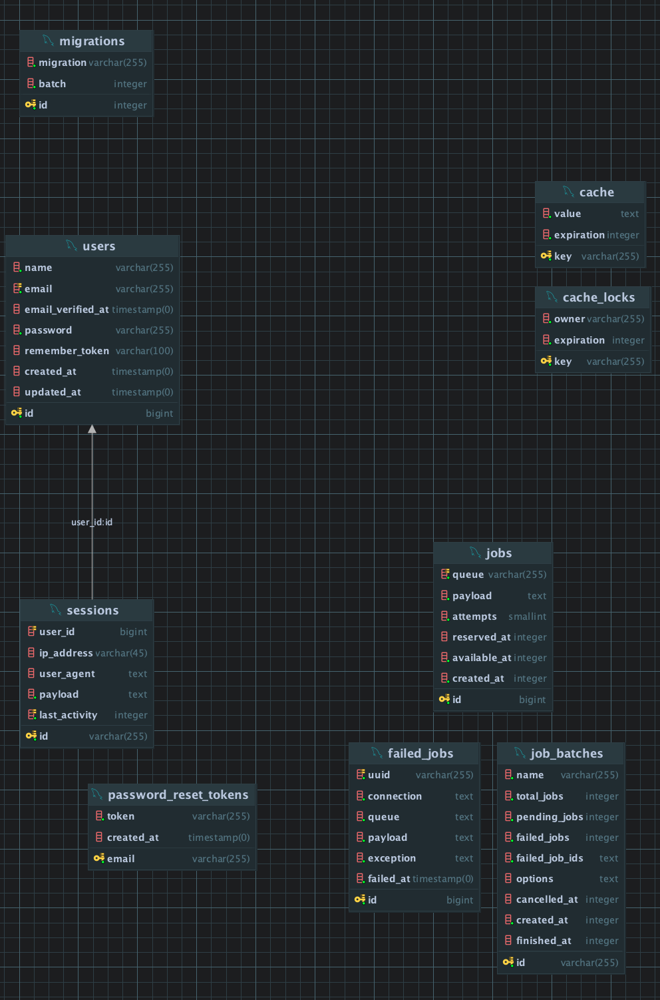

# Laravel Roles and Permissions with Spatie

This project only seeks to be a guide and test for the efficient management of roles and permissions in Laravel. 
All of this under the Spatie Laravel-Permissions package.

## ✅ Features
- [x] Roles and Permissions
- [x] Authentication
- [x] Authorization
- [x] Policies
- [x] Gates
- [x] Seeder
- [x] Factory
- [x] Migrations
- [x] Controllers
- [x] Tests
- [x] Routes

## ⚙️ Tech Stack

- Laravel 11
- Postgres 14
- Spatie Laravel-Permission 6.10
- Laravel Sanctum 4.0


## 💾 Installation

Install and run

1. Clone and move to folder
```bash
$ git clone git@github.com:abrahamuchos/roles-with-spatie-permissions.git
$ cd roles-with-spatie-permissions
```

2. Install dependencies
```bash
$  composer install
```
3. Create a copy of the `.env.example` file and rename it to `.env`. Next, configure the necessary environment variables.

4. Generate an application key by running `php artisan key:generate`.

5. Run `php artisan migrate` to create the database tables.

6. Run `php artisandb:seed` to create dummy data and admin user.

7. Run `php artisan serve` to start the Laravel development server.

8. Run `php artisan test` to run the tests.


## 📦 Environment Variables

To run this project, you will need to add the following environment variables to your .env file

```
DB_HOST
DB_PORT
DB_DATABASE
DB_USERNAME
DB_PASSWORD
```

## 🗂️ Docs

This documentation will serve as a guide to understand the management of Roles and permissions as well as how it 
interacts with Laravel Policies. It will also serve as a guide to understand the use of Laravel Sanctum for API authentication.
<br>
[Laravel - Permissions Spatie - Basic usage](https://spatie.be/docs/laravel-permission/v6/basic-usage/role-permissions)
<br>
[Laravel Sanctum Documentation](https://laravel.com/docs/11.x/sanctum)
<br>
[Laravel 11.x Documentation - Authorization (Creating Policies)](https://laravel.com/docs/11.x/authorization#creating-policies)
<br>
[Laravel Roles y Permisos con Spatie Permissions - Code with Luis](https://www.youtube.com/watch?v=nKtJEezp7WI&ab_channel=CodewithLuis)

### Some observations on the database.

**All tables before installing laravel-permissions**


**All tables after installing laravel-permissions**


**Diagram before installing laravel-permissions**



<br>

**Diagram after installing laravel-permissions**


**You can check query into `/docs/query-examples-with-spatie.sql`**

## 🧑‍💻 Authors

- [@abrahamuchos](https://github.com/abrahamuchos)
- [Contact mail](mailto:j.abraham29@gmail.com)

## 📄 License

[MIT](https://choosealicense.com/licenses/mit/)
